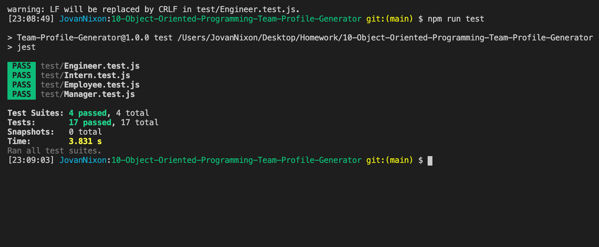

# 10-Object-Oriented-Programming-Team-Profile-Generator

# Description 
This Node CLI builds a team displaying HTML file for a user based on their input.  The user inputs what their role will be, employee ID, email address, gitHub username (engineer) and school (intern).  After the user is done inputting their team, the program generates a static page organizing their information. 
# Table of Contents

1. [Description](#Description)
2. [Installation](#Installation)
3. [Usage](#Usage)
4. [License](#License)
5. [Contributing](#Contributing)
6. [Tests](#Tests)
7. [Questions](#Questions)
8. [Demo](#Demo)
9. [Badges](#Badges)

# Installation
Run node.js and perform an npm install to bring in all necessary node modules. The program is ran with the command "node index.js"
# Usage
When generator starts answer question prompts to customize HTML-TEAM
# License

## This application is covered by the MIT license. 
# Contributing
Contributions are excepted. Fill free to fork. 
# Tests
- Jest Tests

# Questions
## GitHub User name 
jmnfire
### Link to GitHub:
### To access the website
https://github.com/jmnfire/10-Object-Oriented-Programming-Team-Profile-Generator
### Email address 
jovan.m.nixon@gmail.com
# Demo

# Badges

